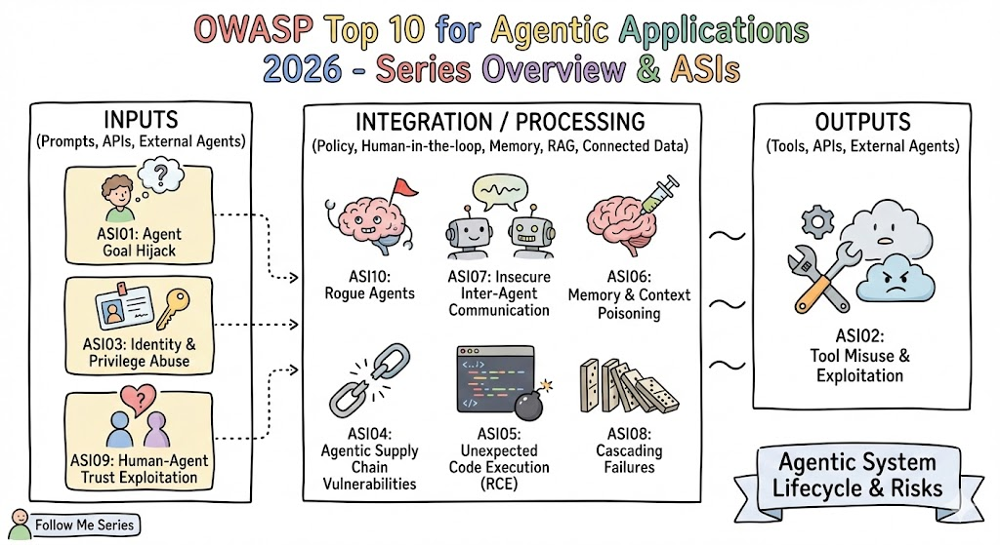

# Agentic AI Security: A 10-Part Series

### Guided by the OWASP Top 10 for Agentic Applications (2026)

Welcome! This repository is a companion to my 10-part series exploring the most critical security risks facing autonomous AI agents today. Based on the **OWASP Agentic Security Initiative (ASI)**, this series breaks down complex vulnerabilities into actionable insights for builders and defenders.

## Project Overview

As AI systems move from simple chat interfaces to autonomous agents that **plan, decide, and act** across multiple systems, the attack surface expands exponentially. This repo contains:

* **Detailed breakdowns** of each ASI vulnerability.
* **Attack scenarios** (how they happen in the real world).
* **Mitigation checklists** for developers.

## The Agentic Security Landscape

Modern agents aren't just LLMs; they are integrated systems. Security must be applied at every layer of the agentic lifecycle.

(Diagram inspired by the Agentic Top 10 At A Glance )

## The 10-Part Series Roadmap

| Part | ID | Topic | Key Focus |
| --- | --- | --- | --- |
| **01** | **ASI01** | [Agent Goal Hijack](https://www.google.com/search?q=%23) | Preventing attackers from redirecting agent objectives.|
| **02** | **ASI02** | [Tool Misuse & Exploitation](https://www.google.com/search?q=%23) | Securing how agents apply legitimate tools unsafely.|
| **03** | **ASI03** | [Identity & Privilege Abuse](https://www.google.com/search?q=%23) | Managing delegated trust and "Confused Deputy" risks. |
| **04** | **ASI04** | [Agentic Supply Chain](https://www.google.com/search?q=%23) | Securing dynamic tool loading and third-party artifacts. |
| **05** | **ASI05** | [Unexpected Code Execution](https://www.google.com/search?q=%23) | Preventing RCE via agent-generated code or "vibe coding". |
| **06** | **ASI06** | [Memory & Context Poisoning](https://www.google.com/search?q=%23) | Protecting long-term memory from persistent corruption. |
| **07** | **ASI07** | [Insecure Inter-Agent Comm](https://www.google.com/search?q=%23) | Securing messages between cooperating agents. |
| **08** | **ASI08** | [Cascading Failures](https://www.google.com/search?q=%23) | Containing faults before they spread across agent networks. |
| **09** | **ASI09** | [Human-Agent Trust](https://www.google.com/search?q=%23) | Preventing manipulation via "Anthropomorphism". |
| **10** | **ASI10** | [Rogue Agents](https://www.google.com/search?q=%23) | Managing agents that drift from their intended governance. |

## Core Defense Principles

Throughout this series, we emphasize three primary safeguards:

1. **Least Agency:** Only grant an agent the autonomy it absolutely needs.
2. **Human-in-the-Loop (HITL):** Require human approval for high-impact or irreversible actions.
3. **Observability:** Maintain immutable, signed logs of all agent actions and tool calls.

## Resources & References

* [OWASP GenAI Security Project](https://genai.owasp.org) 
* [Full OWASP Agentic Top 10 PDF (2026)](https://www.google.com/search?q=./OWASP-Top-10-for-Agentic-Applications-2026-12.6-1.pdf)
* [Agentic AI Security Mapping Matrix](https://genai.owasp.org/resource/owasp-top-10-for-agentic-applications-for-2026/) 

---

**Disclaimer:** The information provided is for educational purposes only. Always consult legal and security professionals before deploying autonomous systems in production.
